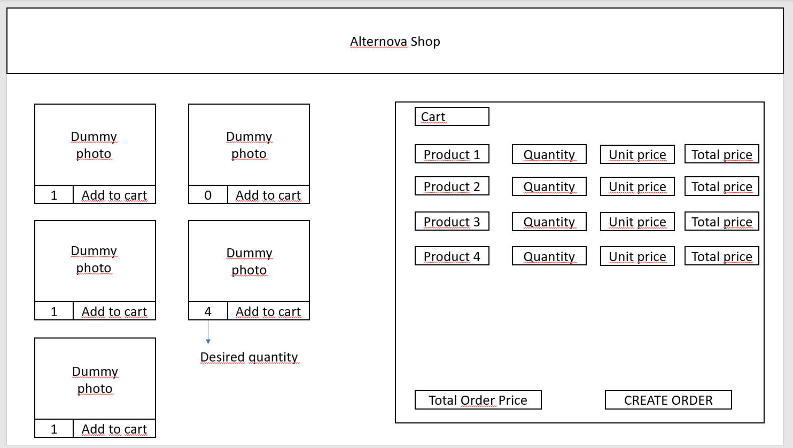

# Instructions

We're building an online shopping site from the ground up using HTML, Javascript and CSS. You may use Bootstrap or any other UI library of your choice.

The application should not have a backend.

### This is what the application needs to do:

- [ ] Read a JSON file from the project with the list of available products, the quantity in stock, and the price per unit.

- [ ] Render the store layout with a dummy image in all the products. You can have any image in the project. We should be able to test the layout in a desktop- screen and a iPhone X screen size.

- [ ] Have a cart that will be filled when clicking add to cart. If a product doesn't have enough stock it should not be added to the cart and a visual indicator should be shown.

- [ ] Generate a new JSON file once the order button is clicked. The JSON file should have the products, the quantity that will be bought, the total price per product, and the total price of the order. You are free to propose the result JSON structure.

## Hints

- [ ] JSON structure that the app should read:

```json

{
  "products": 
  [
    {"name": "redbull","unit_price": 5000,"stock": 5},
    {"name": "rice","unit_price": 2000,"stock": 0},
    {"name": "papitas de limón margarita","unit_price": 1500,"stock": 1},
    {"name": "meat / pound","unit_price": 500,"stock": 8}
  ]
}

```

- [ ] Mockup of the store:


